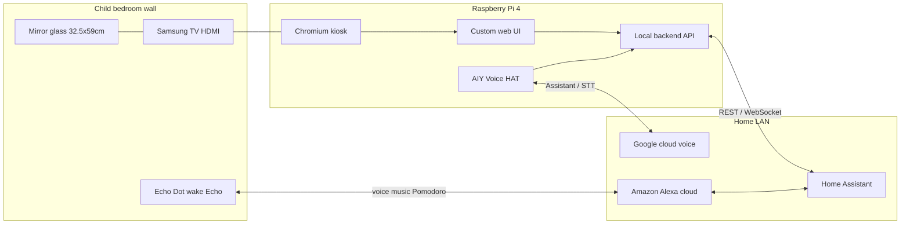

# Architecture — Wall Magic Mirror

**Version:** 0.4 (draft)  
**Last updated:** 2026-03-20

---

## 1. Context

**Runtime data path:** Browser loads **only** the custom UI from **loopback**; **HA long-lived token** stays in the **local backend** (never shipped to Chromium). **Echo Dot** (“**Echo**” wake word) is the occupant’s primary voice path for **music** and **Pomodoro** control **via HA** (Alexa ↔ HA integration); mirror **displays** HA state (e.g. **FR-008** countdown). Mirror **AIY** voice remains optional for mirror-specific commands.

---

## 2. Logical components

| Component | Responsibility | Notes |
|-----------|----------------|-------|
| **Chromium kiosk** | Full-screen shell, autostart | See skill **`mm-kiosk-pi`** |
| **Mirror app (frontend)** | Layout, modules, theming, **night mode**, **Pomodoro tile (FR-008)** | Custom web (HTML/CSS/JS or light framework); **not** MagicMirror² |
| **Local backend** | HA REST/WebSocket proxy, optional voice bridge | Holds token; exposes minimal JSON to UI — **FR-006** |
| **HA client** (in backend) | Subscribe to entities, call services | Token auth; reconnect logic — skill **`mm-home-assistant`** |
| **Voice stack** | Capture, cloud recognition, intent → HA | AIY + Google cloud — skill **`mm-voice-aiy-google`** |
| **Audio output** | TTS / chimes | **HAT speaker** and/or **HDMI → TV speakers** — pick default + override in FSD |
| **Config & secrets** | Non-committed credentials | `.env` or systemd drop-ins, `chmod 600` |

---

## 3. Integration boundaries

- **Home Assistant:** Single source of truth for device state and most automations. Mirror sends **limited** service calls (whitelist in FSD). Runtime uses **official REST/WebSocket APIs** only. **Pomodoro** timers / phase helpers live in HA; mirror **subscribes** for **FR-008** display.
- **Echo Dot:** **Child bedroom**; wake word **“Echo”**. Voice → **Amazon Alexa** → **Home Assistant** (configured integration) for scenes, scripts, or exposed entities — used for **Pomodoro** control so the mirror stays in sync with HA.
- **Google cloud:** Voice recognition / Assistant; align with AIY kit software path when implementation starts.
- **GitHub:** Source for application code and docs; **excludes** secrets (see `.gitignore`).
- **MCP (Cursor):** **Developer tooling only** on your PC — see skill **`mm-dev-mcp-ha`**. **Not** installed on the Pi for mirror operation.

---

## 4. Architectural decisions

| Decision | Options | Status |
|----------|---------|--------|
| **UI platform** | Custom web + local backend vs MagicMirror² | **Chosen: custom web + HA API** (Chromium kiosk) |
| Voice runtime | AIY Google Assistant image / stack vs custom pipeline | **Cloud-backed** agreed; exact stack TBD |
| **Display mode** | **720p** planning baseline | Assume **1280×720** until Samsung **native resolution** confirmed; upgrade layout to **1080p** if supported |
| **Audio default** | HAT speaker vs HDMI TV audio | TBD — may support switch (e.g. night = quieter HAT) |
| OS | Raspberry Pi OS Lite + kiosk vs full desktop | TBD |
| Remote access | SSH LAN only vs Tailscale | TBD |

---

## 5. Security baseline (target)

- Dedicated HA **user** or token scoped to required entities only (if HA supports fine scoping in your version).
- Firewall: Pi accepts no WAN ports; HA stays on trusted LAN.
- SSH: key-based auth; disable password login when stable.
- Google: use project / device credentials per AIY or Assistant docs — **never** commit OAuth secrets.
- **Chromium** must not contain HA token in JS source, localStorage, or query strings served to the UI.
- Backups: document SD card imaging or `rsync` strategy in README when ops phase starts.

---

## 6. Physical / enclosure

- **Viewable mirror area:** **32.5 cm × 59 cm** (two-way glass).
- **Display:** Samsung TV, **120 V** power, already **installed in wooden frame** with glass.
- **HDMI wake:** Unknown whether TV turns on or switches input from Pi alone — validate during bring-up.
- **Thermal:** Pi + TV in cavity — keep airflow and service access per [PROJECT_BRIEF.md](PROJECT_BRIEF.md) risks.
- **Acoustics:** Mic on HAT; TV speakers via HDMI may be preferred for clarity — UX should still show **visual** voice state.

---

## 7. Cursor / Claude reference skills

| Skill | Topic |
|-------|--------|
| `mm-home-assistant` | REST/WebSocket, token hygiene, reconnect |
| `mm-kiosk-pi` | Chromium, systemd, HDMI |
| `mm-voice-aiy-google` | AIY + Google cloud, audio, intents |
| `mm-dev-mcp-ha` | MCP on dev machine only |

---

## 8. References

Curated links: [../resources/reference/](../resources/reference/README.md).
