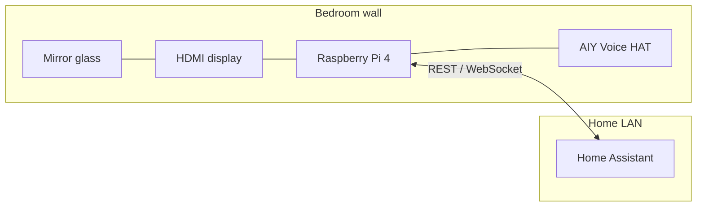

# Architecture — Wall Magic Mirror

**Version:** 0.1 (draft)  
**Last updated:** 2026-03-20

---

## 1. Context

---

## 2. Logical components

| Component | Responsibility | Notes |
|-----------|----------------|-------|
| **Display shell** | Full-screen UI, auto-start on boot | Typically Chromium kiosk or Wayland-friendly browser |
| **Mirror app** | Layout, modules, theming | Web or native TBD in FSD |
| **HA client** | Subscribe to entities, call services | Token auth; reconnect logic |
| **Voice stack** | Capture, VAD/wake, STT, intent → HA | AIY path vs local stack TBD |
| **Config & secrets** | Non-committed credentials | `.env` or systemd drop-ins, `chmod 600` |

---

## 3. Integration boundaries

- **Home Assistant:** Single source of truth for device state and most automations. Mirror sends **limited** service calls (whitelist in FSD).
- **GitHub:** Source for application code and docs; **excludes** secrets and large binaries (see `.gitignore`).
- **MCP:** Developer tooling only unless explicitly added as a runtime feature later.

---

## 4. Open architectural decisions

Record the **chosen** option in this table as the project matures.

| Decision | Options | Status |
|----------|---------|--------|
| UI platform | e.g. MagicMirror², custom React/Vue, static + HTMX | TBD |
| Voice | Google Assistant via AIY vs Porcupine/Rhasspy + HA Assist | TBD |
| OS | Raspberry Pi OS Lite + kiosk vs full desktop | TBD |
| Remote access | SSH LAN only vs Tailscale | TBD |

---

## 5. Security baseline (target)

- Dedicated HA **user** or token scoped to required entities only (if HA supports fine scoping in your version).
- Firewall: Pi accepts no WAN ports; HA stays on trusted LAN.
- SSH: key-based auth; disable password login when stable.
- Backups: document SD card imaging or `rsync` strategy in README when ops phase starts.

---

## 6. Physical / enclosure (cross-discipline)

- **Thermal:** Pi + display in a cavity — plan airflow before final glue-up.
- **Acoustics:** Mic behind glass may attenuate highs; UX may need **visual** confirmation for voice commands.
- **Service access:** How to reach SD / USB / power without destroying frame — one “service panel” detail worth a CAD note.

---

## 7. References

Drop links and PDFs under [../resources/reference/](../resources/reference/README.md) and cite them here as the stack firms up.
