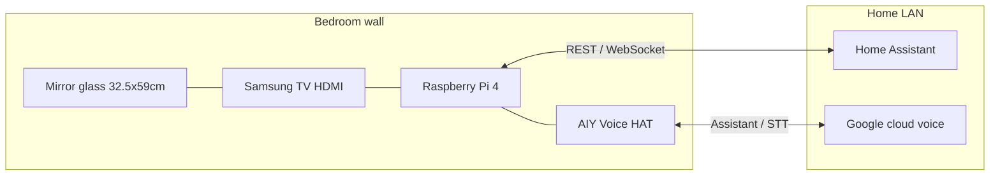

# Architecture — Wall Magic Mirror

**Version:** 0.2 (draft)  
**Last updated:** 2026-03-20

---

## 1. Context

---

## 2. Logical components

| Component | Responsibility | Notes |
|-----------|----------------|-------|
| **Display shell** | Full-screen UI, auto-start on boot | Typically Chromium kiosk or Wayland-friendly browser |
| **Mirror app** | Layout, modules, theming, **night mode** | Web or native TBD in FSD |
| **HA client** | Subscribe to entities, call services | Token auth; reconnect logic |
| **Voice stack** | Capture, wake, cloud recognition, intent → HA | **Google account/cloud OK** for v1; AIY hardware |
| **Audio output** | TTS / chimes | **HAT speaker** and/or **HDMI → TV speakers** — pick default + override in FSD |
| **Config & secrets** | Non-committed credentials | `.env` or systemd drop-ins, `chmod 600` |

---

## 3. Integration boundaries

- **Home Assistant:** Single source of truth for device state and most automations. Mirror sends **limited** service calls (whitelist in FSD).
- **Google cloud:** Voice recognition / Assistant; align with AIY kit software path when implementation starts.
- **GitHub:** Source for application code and docs; **excludes** secrets (see `.gitignore`).
- **MCP:** Developer tooling only unless explicitly added as a runtime feature later.

---

## 4. Open architectural decisions

| Decision | Options | Status |
|----------|---------|--------|
| UI platform | e.g. MagicMirror², custom React/Vue, static + HTMX | TBD |
| Voice runtime | AIY Google Assistant image / stack vs custom pipeline | **Cloud-backed** agreed; exact stack TBD |
| **Display mode** | **720p** planning baseline | Assume **1280×720** until Samsung **native resolution** confirmed; upgrade layout to **1080p** if supported |
| **Audio default** | HAT speaker vs HDMI TV audio | TBD — may support switch (e.g. night = quieter HAT) |
| OS | Raspberry Pi OS Lite + kiosk vs full desktop | TBD |
| Remote access | SSH LAN only vs Tailscale | TBD |

---

## 5. Security baseline (target)

- Dedicated HA **user** or token scoped to required entities only (if HA supports fine scoping in your version).
- Firewall: Pi accepts no WAN ports; HA stays on trusted LAN.
- SSH: key-based auth; disable password login when stable.
- Google: use project / device credentials per AIY or Assistant docs — **never** commit OAuth secrets.
- Backups: document SD card imaging or `rsync` strategy in README when ops phase starts.

---

## 6. Physical / enclosure

- **Viewable mirror area:** **32.5 cm × 59 cm** (two-way glass).
- **Display:** Samsung TV, **120 V** power, already **installed in wooden frame** with glass.
- **HDMI wake:** Unknown whether TV turns on or switches input from Pi alone — validate during bring-up.
- **Thermal:** Pi + TV in cavity — keep airflow and service access per [PROJECT_BRIEF.md](PROJECT_BRIEF.md) risks.
- **Acoustics:** Mic on HAT; TV speakers via HDMI may be preferred for clarity — UX should still show **visual** voice state.

---

## 7. References

Drop links and PDFs under [../resources/reference/](../resources/reference/README.md) and cite them here as the stack firms up.
