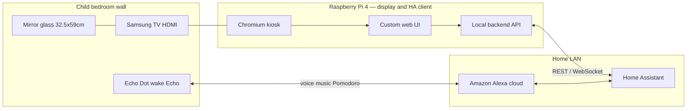

# Architecture — Wall Magic Mirror

**Version:** 0.5 (draft)  
**Last updated:** 2026-03-20

---

## 1. Context (v1)

**v1 simplification:** The Pi **does not** run mirror-mounted voice capture (no AIY HAT in initial build). **Echo Dot** is the only voice UI; **HA** holds timers, lists, calendar, weather entities the mirror **renders**.

**Future (optional):** Google **AIY Voice HAT** on the Pi could add mirror-local wake word / custom intents — see [PROJECT_BRIEF.md](PROJECT_BRIEF.md) out-of-scope for v1.

---

## 2. Logical components

| Component | Responsibility | Notes |
|-----------|----------------|-------|
| **Chromium kiosk** | Full-screen shell, autostart | Skill **`mm-kiosk-pi`** |
| **Mirror app (frontend)** | Tiles: clock, **weather**, **todo**, **school calendar**, **Pomodoro (FR-008)**, night mode, etc. | Custom web; **not** MagicMirror² |
| **Local backend** | HA REST/WebSocket proxy | Token here — **FR-006**; no voice pipeline in v1 |
| **HA client** (in backend) | Subscribe to entities, optional whitelisted service calls | Skill **`mm-home-assistant`** |
| **Voice (v1)** | **Echo → Alexa → HA** | Music, Pomodoro phrases, routines; mirror is **read-mostly** for those entities |
| **Config & secrets** | Non-committed credentials | `.env` / systemd, `chmod 600` |

---

## 3. Integration boundaries

- **Home Assistant:** Source of truth for **weather**, **calendar** (school), **todo/list** entities, **Pomodoro** timers, **mirror mode** helpers. Mirror **displays**; limited **write** only if FSD whitelists (e.g. future “complete task” from UI).
- **Echo Dot:** Wake word **“Echo”**. All **v1** voice paths end in **HA** for anything the mirror must show (use HA timers/scripts, not Alexa-only kitchen timers, for Pomodoro sync).
- **GitHub:** Code + docs; no secrets.
- **MCP (Cursor):** Dev PC only — **`mm-dev-mcp-ha`**.

---

## 4. Architectural decisions

| Decision | Options | Status |
|----------|---------|--------|
| **UI platform** | Custom web + local backend vs MagicMirror² | **Chosen:** custom web + HA API |
| **Voice (v1)** | Echo only vs Echo + AIY on Pi | **Chosen: Echo → HA only**; AIY **deferred** |
| **Display mode** | 720p baseline | **1280×720** until TV native res known |
| **Audio (v1)** | Pi vs Echo | **Echo + speakers** for TTS/music; Pi **HDMI display** primary |
| OS | Pi OS Lite + kiosk vs desktop | TBD |
| Remote access | SSH / Tailscale | TBD |

---

## 5. Security baseline (target)

- HA token: least privilege; **never** in browser bundle.
- Firewall: no inbound WAN to Pi.
- SSH: keys, no password when stable.
- **Google / AIY OAuth** — **N/A v1**; if AIY returns, never commit secrets.
- Backups: SD / `rsync` when ops phase starts.

---

## 6. Physical / enclosure

- **Viewable mirror area:** **32.5 cm × 59 cm**.
- **Samsung TV** + frame; **HDMI** from Pi; **120 V** TV power separate from Pi.
- **Acoustics (v1):** **Echo** placement drives voice UX; mirror can show **visual** cues only (no “listening” LED from HAT).

---

## 7. Cursor / Claude reference skills

| Skill | Topic |
|-------|--------|
| `mm-home-assistant` | REST/WebSocket, entities for tiles |
| `mm-kiosk-pi` | Chromium, systemd, HDMI |
| `mm-voice-aiy-google` | **Future** — AIY + Google if scope returns |
| `mm-dev-mcp-ha` | MCP on dev machine only |

---

## 8. References

[../resources/reference/](../resources/reference/README.md)
