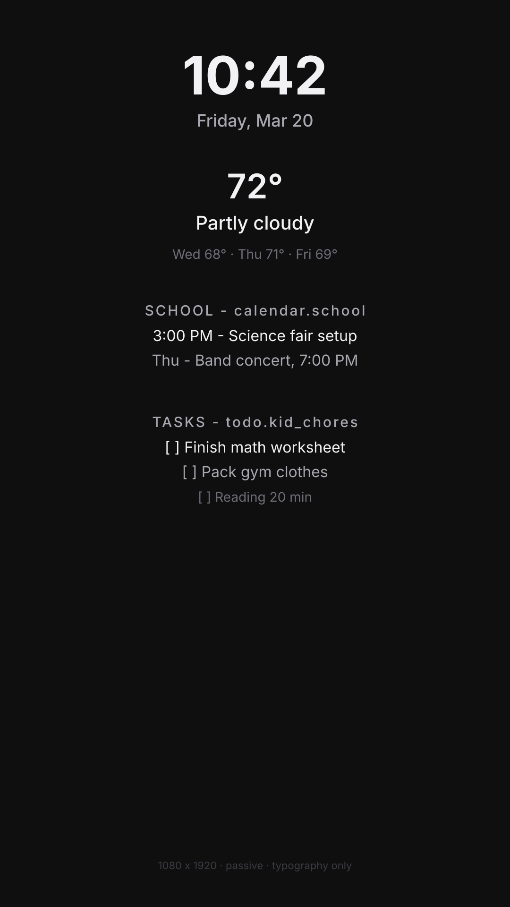
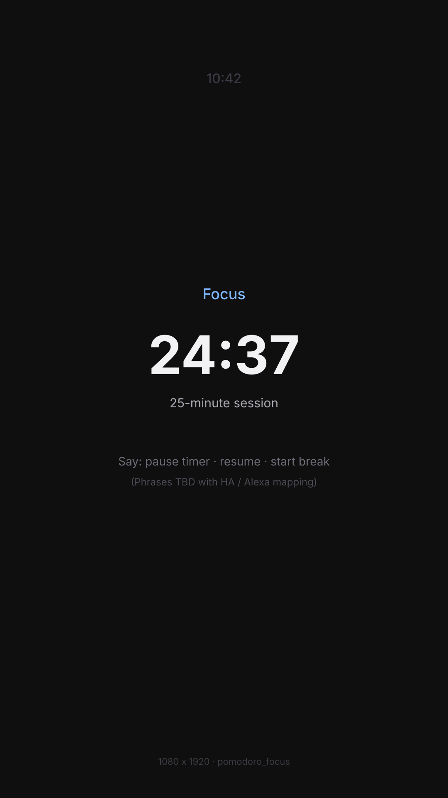

# Layout wireframes — 1080×1920 portrait

**Viewport:** **1080×1920** (portrait), confirmed on mirror Pi ([DESIGN_READINESS.md](../DESIGN_READINESS.md), [MIRROR_CONTEXT.md](../MIRROR_CONTEXT.md)).

**Style:** Dark field (**`#0f0f10`**), **no cards, borders, or decorative panels** — hierarchy is **type size, weight, and vertical spacing** only. Sample data is realistic; **calendar** / **todo** use **placeholder entity labels** (`calendar.school`, `todo.kid_chores`) until Architect/household lock IDs.

**Minimum far (~10 ft) sizes** are documented in [tokens.md](tokens.md) and reflected in these SVGs.

---

## Passive (`passive`)

**Order:** Clock → today’s weather → compact forecast → school calendar → tasks (see [module-priority.md](module-priority.md)).

*Source file:* [layout-1080x1920-passive.svg](layout-1080x1920-passive.svg)

---

## Pomodoro focus (`pomodoro_focus`)

**Order:** Phase + **large** countdown + supportive subline + **voice hints** (no touch chrome for v1). Corner time is optional and **subordinate** ([module-priority.md](module-priority.md)).

*Source file:* [layout-1080x1920-pomodoro.svg](layout-1080x1920-pomodoro.svg)

---

## Other modes (reference)

| Mode | Layout note |
|------|-------------|
| **`sleep_off`** | Prefer **blank or very dim** full field; if time shown, use **night** tokens only — no secondary modules ([UI_MODES.md](../UI_MODES.md)). No separate SVG until behavior is locked in FSD. |
| **`active_engaged`** | **Same canvas** as passive; **elevate** the triggered module (calendar or todo) and **de-emphasize** weather/secondary — fluid weights/opacity, not a new frame. Coder implements via M-007 visibility rules. |

---

## Safe area

Reserve **≥ 40 px** side inset, **≥ 48 px** bottom — bezel unknown; see [tokens.md](tokens.md).
